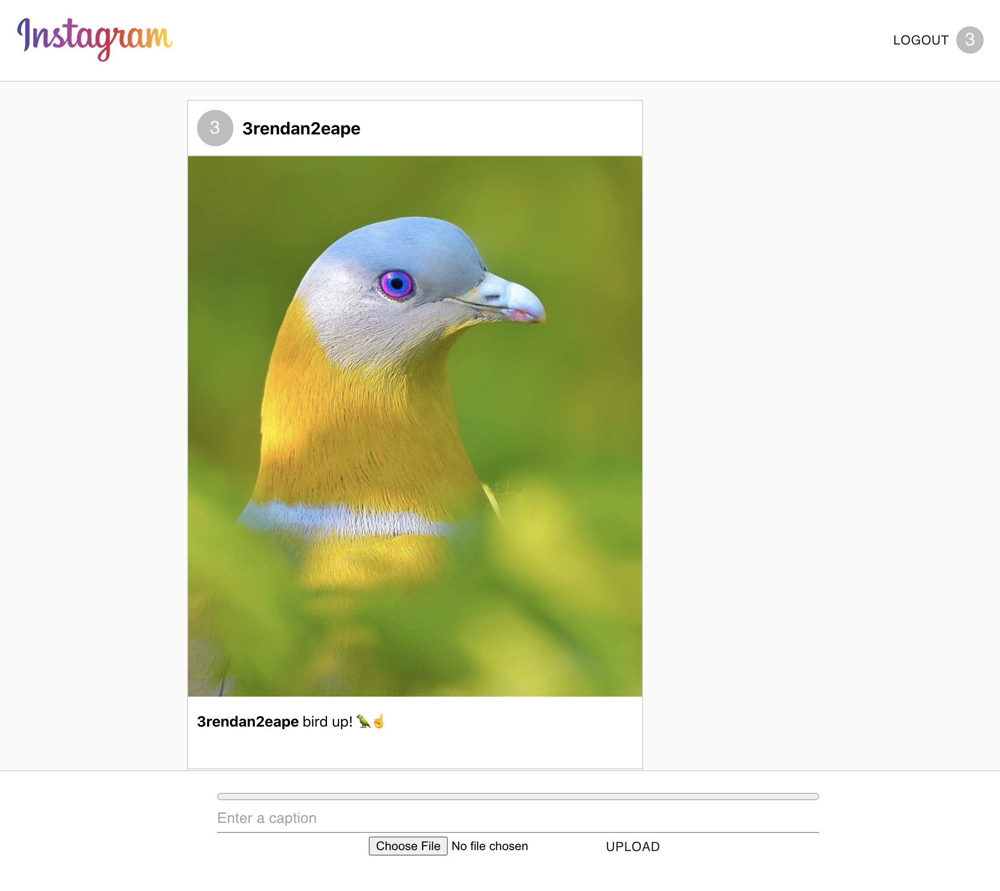
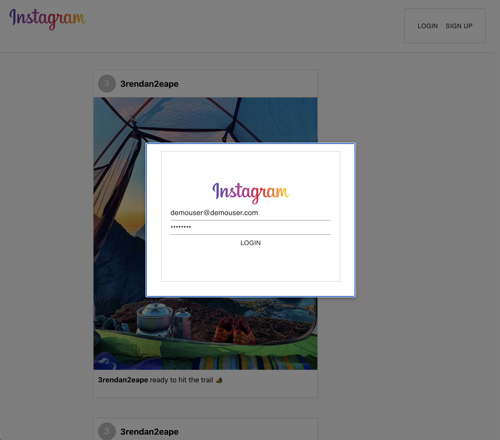
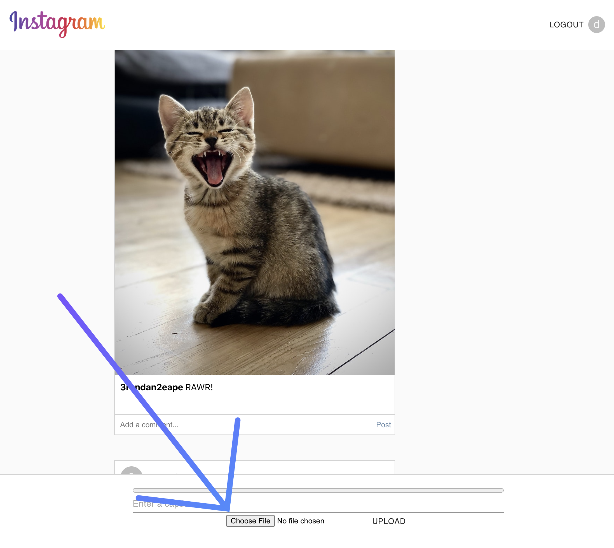

# Instagram Clone

**Live:** https://instagram-client-d08fd.web.app/

## Description:

This Instagram clone includes the basic features of the real-deal app. Users can upload photos, as well as leave comments on others' photos. The app has user authentication built in, and a user account is required to do anything beyond browsing the content uploaded by other users. Feel free to make your own account or use the demo account credentials below!

## Login Credentials:

User Email: demouser@demouser.com 
Password: demouser

## Uploading Photos:

Once logged in, head to the bottom of your browser window and click the "choose file" button. From there you will be prompted to choose a photo from your device. After you've selected your desired photo, write a caption in the space provided. Once ready, click "UPLOAD" and you'll see your content immediately displayed on the screen.

## Commenting:

Simply find the post you'd like to leave a comment on, click the space below the post labeled "Add a comment..." and type your message. When you're ready to post your comment, click "Post".

## Technology Used:

**HTML5, CSS3, JavaScript, Material UI, React, Node.js, Express, Pusher, MongoDB, Firebase**
